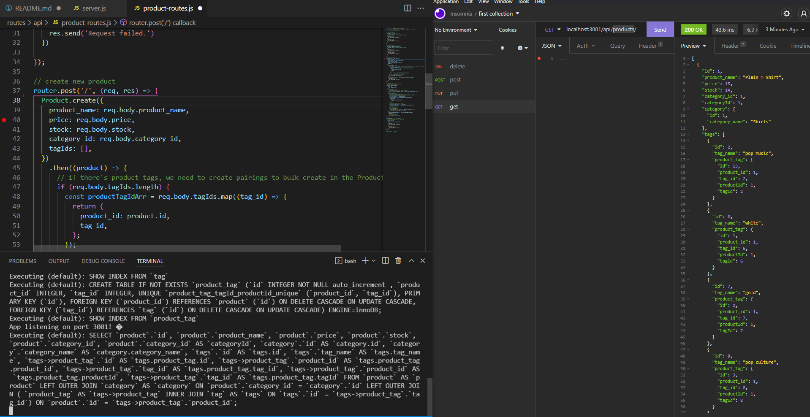
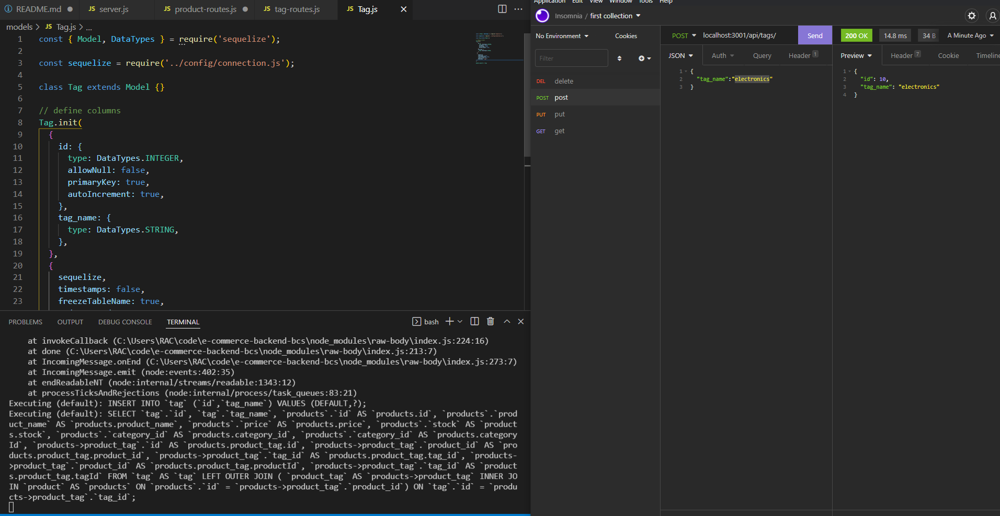
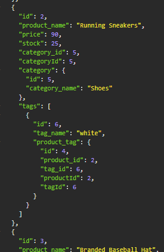
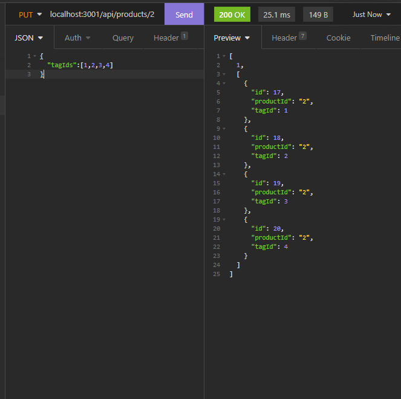
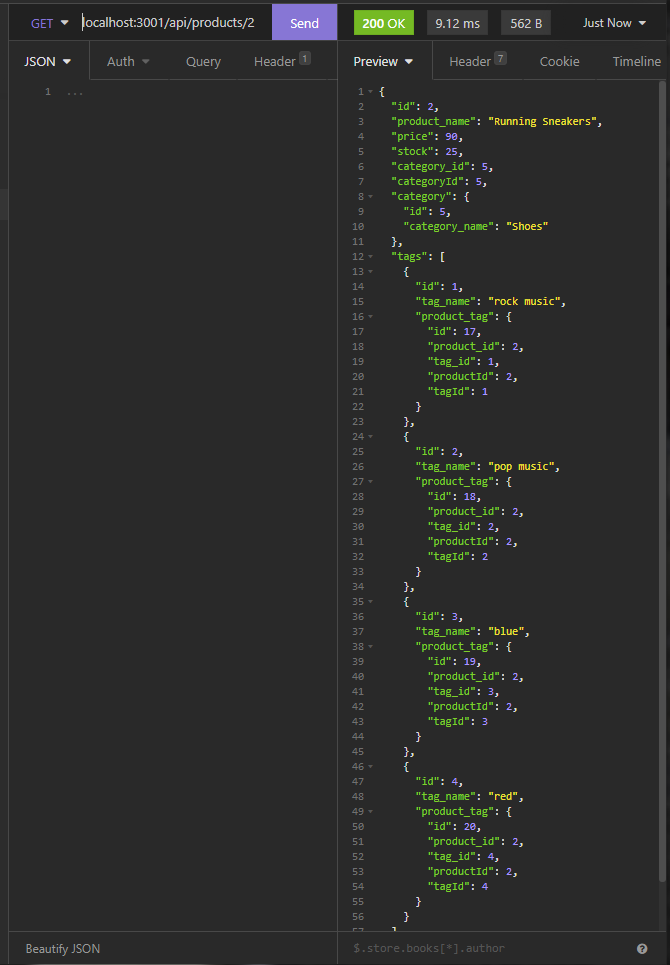
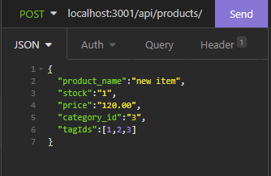
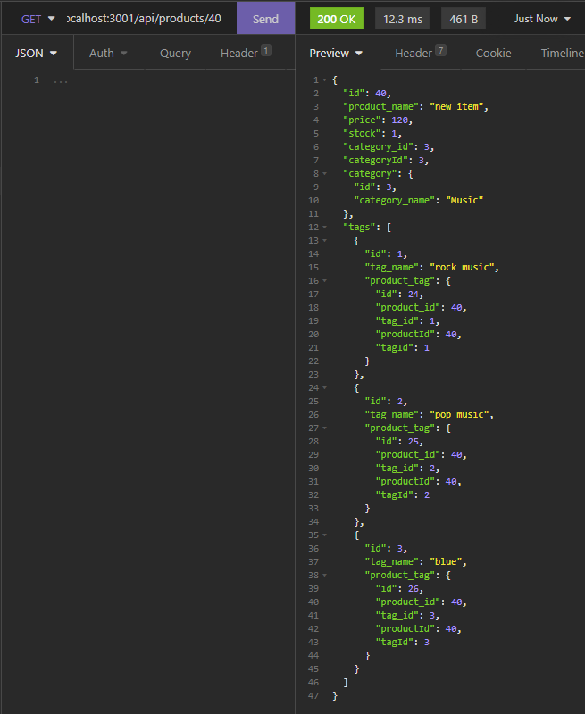

# e-commerce-backend-bcs

[](https://opensource.org/licenses/MIT)

## Description

E-Commerce-Backend emulates the behind-the-scenes action of everyday retailers and how they keep track of goods. This app allows the user to immerse themselves in the backend of a simulated retailer and add products, product categories, and product tags in a process similar to how one would in a real-world setting. E-Commerce-Backend is essentially a database and Express server with complete CRUD functionality that allows information to be limitlessly appended to and removed from the database. I built this project to gain a better understanding of object-relational mapping and to test my understanding of how to construct a server. Using this app has gained me insight on how data is managed behind-the-scenes, and I am excited to apply this insight in other fields herefrom. 

## Table of Contents

- [Installation](#installation)
- [Usage](#usage)
- [Credits](#credits)
- [License](#license)
- [Tests](#tests)

## Installation

 The app doesn't require any installation to use per se since it is hosted live on Heroku. However, in order for one to perform CRUD functions with the app in the absence of an actual front-end UI, some sort of program that can do so may be necessary, e.g. Insomnia.

## Usage

As this is a CRUD application, all CRUD requests must be routed correctly or they may fail. All CRUD request routes for this app are simple and as follows:

To perform a GET request to either products, categories, or tags, write as follows, respectively:
```md
baseurl/api/products
baseurl/api/categories
baseurl/api/tags
```
To make any changes to Products, write:
```md
baseurl/api/products
```
To make a change to a specific Product, write as follows, and substite :id with the integer id that identifies that product (perform a GET request on products first to see the integer id of all products):
```md
baseurl/api/products/:id
```
To make any changes to Categories, write:
```md
baseurl/api/categories
```
To make a change to a specific Category, write as follows, and substite :id with the integer id that identifies that Category (perform a GET request on categories first to see the integer id of all categories):
```md
baseurl/api/categories/:id
```
To make any changes to tags, write:
```md
baseurl/api/tags
```
To make a change to a specific Tag, write as follows, and substite :id with the integer id that identifies that Tag (perform a GET request on tags first to see the integer id of all tags):
```md
baseurl/api/tags/:id
```

The following images demonstrate how proper GET, POST, and PUT requests should look.










## Tests

As previously mentioned, the app has full CRUD functionatliy; this means you can perform GET, POST, PUT, and DELETE actions on the live database. All requests and actions must be routed properly and use the same format as the model, i.e. if creating a new product, one must POST to /api/products/ and have a 
1. product_name
2. price
3. stock
4. category_id
5. tagIds

Different models have different criteria. Some, but not all, of these properties are mandatory, and some of them can only be integers, others only strings. For exact details, refer to each model individually, located in the models folder. Since there is no front-end form to fill out that would pre-stucturize these CRUD requests, one must take care to ensure that their "manual" requests follow model convention, otherwise a "Request failed" may appear.


## License

MIT License

Copyright (c) [2022] [shnala]

Permission is hereby granted, free of charge, to any person obtaining a copy
of this software and associated documentation files (the "Software"), to deal
in the Software without restriction, including without limitation the rights
to use, copy, modify, merge, publish, distribute, sublicense, and/or sell
copies of the Software, and to permit persons to whom the Software is
furnished to do so, subject to the following conditions:

The above copyright notice and this permission notice shall be included in all
copies or substantial portions of the Software.

THE SOFTWARE IS PROVIDED "AS IS", WITHOUT WARRANTY OF ANY KIND, EXPRESS OR
IMPLIED, INCLUDING BUT NOT LIMITED TO THE WARRANTIES OF MERCHANTABILITY,
FITNESS FOR A PARTICULAR PURPOSE AND NONINFRINGEMENT. IN NO EVENT SHALL THE
AUTHORS OR COPYRIGHT HOLDERS BE LIABLE FOR ANY CLAIM, DAMAGES OR OTHER
LIABILITY, WHETHER IN AN ACTION OF CONTRACT, TORT OR OTHERWISE, ARISING FROM,
OUT OF OR IN CONNECTION WITH THE SOFTWARE OR THE USE OR OTHER DEALINGS IN THE
SOFTWARE.